<div align="center">

# 🦊 Foxed Has Mobiles

### *The Noodle Mountain Saga Continues...*


<p align="center">
  <strong>A blazingly fast, beautifully crafted full-stack TypeScript experience</strong>
</p>

[](https://www.typescriptlang.org/)
[](https://reactjs.org/)
[](https://expressjs.com/)
[](https://vitejs.dev/)
[](https://tailwindcss.com/)
[](https://www.postgresql.org/)

[](https://opensource.org/licenses/MIT)
[](http://makeapullrequest.com)
[](https://github.com/heyns1000)

</div>

---

## ✨ What Makes This Special

> *Where the foxes roam and the noodles flow like rivers down mountainsides...*

Foxed Has Mobiles isn't just another full-stack app—it's a journey through the **Noodle Mountain Saga**, where cutting-edge tech meets elegant design. Built with the modern web in mind, this powerhouse combines React's flexibility with Express's reliability, all wrapped in TypeScript's type-safe embrace.

---

## 🔍 The First Clue

> *"In the land where rubber meets road, and a single nail holds the truth of nations,*  
> *The fox awaits those who dare to verify at the atomic level.*  
> *Sign in, Champion, and follow the red fox under five full moons..."*

**Hint:** *The journey begins with authentication. Only those who create an account shall discover the truth behind the Noodle Mountain Saga.* 🦊🪘

---

## 🎯 Features That'll Make You Hungry

<table>
<tr>
<td width="50%">

### 🎨 **Frontend Magic**
- ⚛️ **React 18.3** - Latest & greatest
- 🎭 **Framer Motion** - Buttery smooth animations
- 🎨 **Radix UI** - Accessible component primitives
- 🎪 **Shadcn/ui** - Beautiful, customizable components
- 🌙 **Dark Mode** - Easy on the eyes, night or day
- 📱 **Fully Responsive** - Mobile-first design philosophy

</td>
<td width="50%">

### ⚡ **Backend Power**
- 🚀 **Express.js** - Battle-tested server framework
- 🔐 **Passport.js** - Rock-solid authentication
- 💾 **Drizzle ORM** - Type-safe database queries
- 🐘 **PostgreSQL** - Industrial-strength data storage
- 🔄 **WebSocket** - Real-time communication
- 📦 **Session Management** - Secure user sessions

</td>
</tr>
</table>

---

## 🛠️ Tech Stack Deep Dive

<div align="center">

### Frontend Arsenal 🎨

| Technology | Purpose | Why It's Awesome |
|------------|---------|------------------|
|  | UI Framework | Component-based architecture |
|  | Data Fetching | Server state management made easy |
|  | Styling | Utility-first CSS framework |
|  | Animations | Production-ready motion library |
|  | Icons | Beautiful, consistent icons |

### Backend Powerhouse ⚙️

| Technology | Purpose | Why It's Awesome |
|------------|---------|------------------|
|  | Server | Fast, unopinionated framework |
|  | ORM | TypeScript-first database toolkit |
|  | Database | Reliable, powerful SQL database |
|  | Auth | Simple, unobtrusive authentication |
|  | Real-time | Bi-directional communication |

### Developer Experience 🎯

| Technology | Purpose | Why It's Awesome |
|------------|---------|------------------|
|  | Language | Type safety everywhere |
|  | Build Tool | Lightning-fast HMR |
|  | Bundler | Blazing fast JavaScript bundler |
|  | Validation | TypeScript-first schema validation |

</div>

---

## 🚀 Quick Start

### Prerequisites

Make sure you have these installed:

```bash
node >= 18.0.0
npm >= 9.0.0
postgresql >= 14.0
```

### Installation

```bash
# Clone this legendary repository
git clone https://github.com/heyns1000/Foxed-Has-Mobiles.git

# Enter the noodle mountain
cd Foxed-Has-Mobiles

# Navigate to the main project
cd Foxed-Has-Mobiles

# Install the magic
npm install

# Set up your environment
cp .env.example .env
# Edit .env with your database credentials

# Push database schema
npm run db:push

# Fire up the development server
npm run dev
```

### 🎮 Available Commands

| Command | Description | When to Use |
|---------|-------------|-------------|
| `npm run dev` | 🔥 Start development server | Daily development |
| `npm run build` | 📦 Build for production | Deployment prep |
| `npm start` | 🚀 Start production server | Production environment |
| `npm run check` | 🔍 TypeScript type checking | Pre-commit validation |
| `npm run db:push` | 🗄️ Push database schema | After schema changes |

---

## 📂 Project Structure

```
Foxed-Has-Mobiles/
│
├── 📁 Foxed-Has-Mobiles/          # Main application
│   ├── 📁 client/                 # React frontend
│   │   ├── 📁 src/
│   │   │   ├── 📁 components/     # Reusable UI components
│   │   │   ├── 📁 hooks/          # Custom React hooks
│   │   │   ├── 📁 pages/          # Application pages
│   │   │   └── 📁 lib/            # Utilities & helpers
│   │   └── 📄 index.html
│   │
│   ├── 📁 server/                 # Express backend
│   │   ├── 📄 index.ts            # Server entry point
│   │   ├── 📁 routes/             # API routes
│   │   ├── 📁 db/                 # Database schemas
│   │   └── 📁 middleware/         # Express middleware
│   │
│   └── 📄 package.json
│
├── 📁 samfox-standalone/          # Standalone module
├── 📁 assets/                     # Images & static files
│   └── 🖼️ noodle-mountain-saga   # The legendary image
│
└── 📄 README.md                   # You are here! 👋
```

---

## 🎨 UI Component Showcase

This project is loaded with **Radix UI** primitives for maximum accessibility:

<div align="center">

| Component | Status | Component | Status |
|-----------|--------|-----------|--------|
| 🎭 Accordion | ✅ | 🎪 Dialog | ✅ |
| 🚨 Alert Dialog | ✅ | 📋 Dropdown Menu | ✅ |
| 🖼️ Avatar | ✅ | 🎯 Hover Card | ✅ |
| ☑️ Checkbox | ✅ | 🎛️ Slider | ✅ |
| 🎚️ Switch | ✅ | 📑 Tabs | ✅ |
| 🍞 Toast | ✅ | 💡 Tooltip | ✅ |
| 📊 Progress | ✅ | 🎨 Popover | ✅ |

</div>

---

## 🔐 Authentication Flow

```mermaid
graph LR
    A[🦊 User] -->|Login| B[Passport.js]
    B -->|Validate| C[PostgreSQL]
    C -->|Session| D[Express Session]
    D -->|Cookie| A
    style A fill:#ff6b6b
    style B fill:#4ecdc4
    style C fill:#45b7d1
    style D fill:#96ceb4
```



---

## 🌟 Key Highlights

### 💎 **Modern React Patterns**
- Custom hooks for reusable logic
- Context providers for global state
- React Query for server state management
- Form handling with React Hook Form + Zod validation

### 🎯 **Type Safety First**
- End-to-end TypeScript coverage
- Zod schemas for runtime validation
- Drizzle ORM for type-safe database queries
- No `any` types allowed! 🚫

### 🎨 **Design System**
- Consistent spacing with Tailwind
- Custom color palettes
- Responsive breakpoints
- Dark mode support with `next-themes`

### ⚡ **Performance Optimized**
- Code splitting with dynamic imports
- Lazy loading for routes
- Optimized bundle sizes with Vite
- Server-side rendering ready

---

## 🤝 Contributing

We welcome contributions from fellow noodle mountain explorers!

```bash
# Fork the repository
# Create your feature branch
git checkout -b feature/AmazingFeature

# Commit your changes
git commit -m '✨ Add some AmazingFeature'

# Push to the branch
git push origin feature/AmazingFeature

# Open a Pull Request
```

---

## 📜 License

This project is licensed under the **MIT License** - see the [LICENSE](LICENSE) file for details.

---

## 🙏 Acknowledgments

- 🍜 **The Noodle Mountain Gods** - For infinite inspiration
- 🦊 **All the Foxes** - For being adorably clever
- 💻 **The Open Source Community** - For incredible tools
- ☕ **Coffee & Tea** - For keeping us awake during late-night coding sessions
- 🪘 **The Baobab Whisperer** - Guardian of ancient wisdom

---

<div align="center">

### 🌟 Star this repo if you find it helpful!

**Made with 💖, 🍜, and lots of ☕**

*"In the mountains where noodles flow and foxes know, the code we write will forever grow"*

[](https://github.com/heyns1000/Foxed-Has-Mobiles/stargazers)
[](https://github.com/heyns1000/Foxed-Has-Mobiles/network/members)
[](https://github.com/heyns1000/Foxed-Has-Mobiles/watchers)

---

**[⬆ Back to Top](#-foxed-has-mobiles)**

</div>